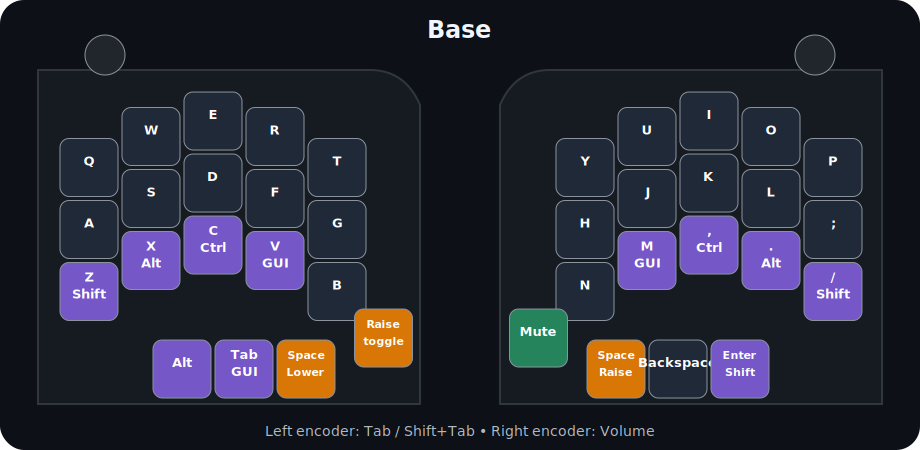
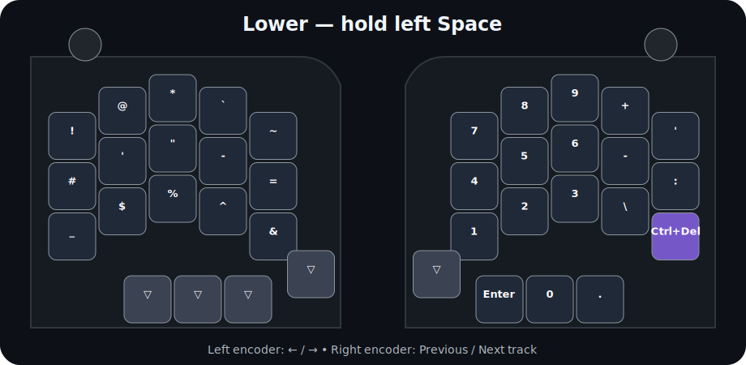
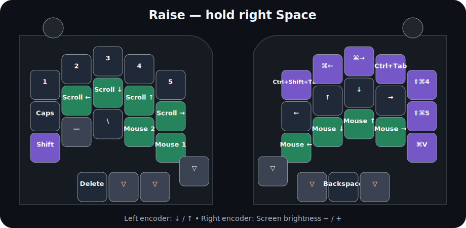
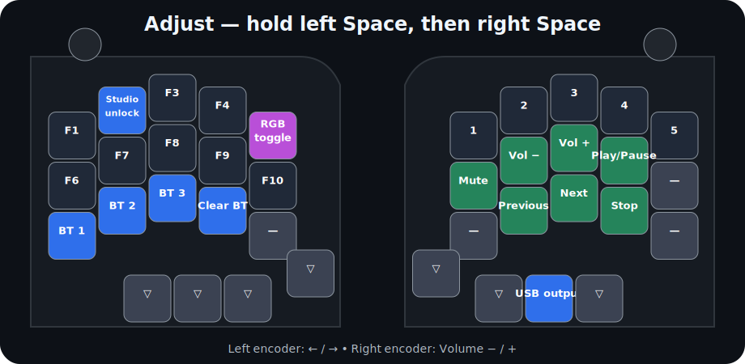

# FLB36

FLB36 is a wireless 36-key split keyboard built around two nice!nano controllers and a dedicated USB dongle. Each half has an encoder, six addressable underglow LEDs, a battery, reset button, and power switch. The dongle provides USB HID, ZMK Studio, and a 128×32 OLED showing both halves' battery levels, charging state, and active Bluetooth profile.

## Everyday use

- Tap either Space key for Space.
- Hold the **left Space** for Lower.
- Hold the **right Space** for Raise.
- Hold the **left Space first**, then the **right Space**, for Adjust.
- Hold Backspace to delete continuously like a conventional keyboard.
- The LEDs run a sunrise animation at startup, turn off after 30 seconds idle, and return with activity.

## Keymaps

### Base



### Lower



### Raise



### Adjust



## Useful combos

| Keys | Output |
|---|---|
| A + S | `|` |
| R + T | `(` |
| F + G | `[` |
| V + B | `{` |
| Y + U | `)` |
| H + J | `]` |
| N + M | `}` |
| J + K | Escape |

## Bluetooth and Studio

On Adjust, `Z`, `X`, and `C` select Bluetooth profiles 1–3. `V` clears the selected profile. Adjust + `W` unlocks [ZMK Studio](https://zmk.studio/) through the USB dongle.

Studio exposes the custom **Peripheral Underglow** behavior for assigning toggle, hue, saturation, brightness, speed, and effect controls. The dongle forwards those commands to both halves.

## OLED

The OLED shows the left battery on the left and the right battery on the right. A lightning mark indicates that USB power is present on that half. Battery readings are intentionally stabilized to avoid distracting voltage jitter. At startup, the dongle displays a three-second **LEROY** splash.

## Firmware

GitHub Actions builds these primary artifacts:

- `flb36_left.uf2`
- `flb36_right.uf2`
- `flb36_dongle.uf2`
- settings-reset firmware for recovery and fresh pairing

Normal updates do not require a settings reset. When a feature changes split communication or peripheral behavior, flash all three primary artifacts.

## Updating the diagrams

After changing `config/flb36.keymap`, update the labels in `docs/render_keymaps.py`, then run:

```sh
python3 docs/render_keymaps.py
```
